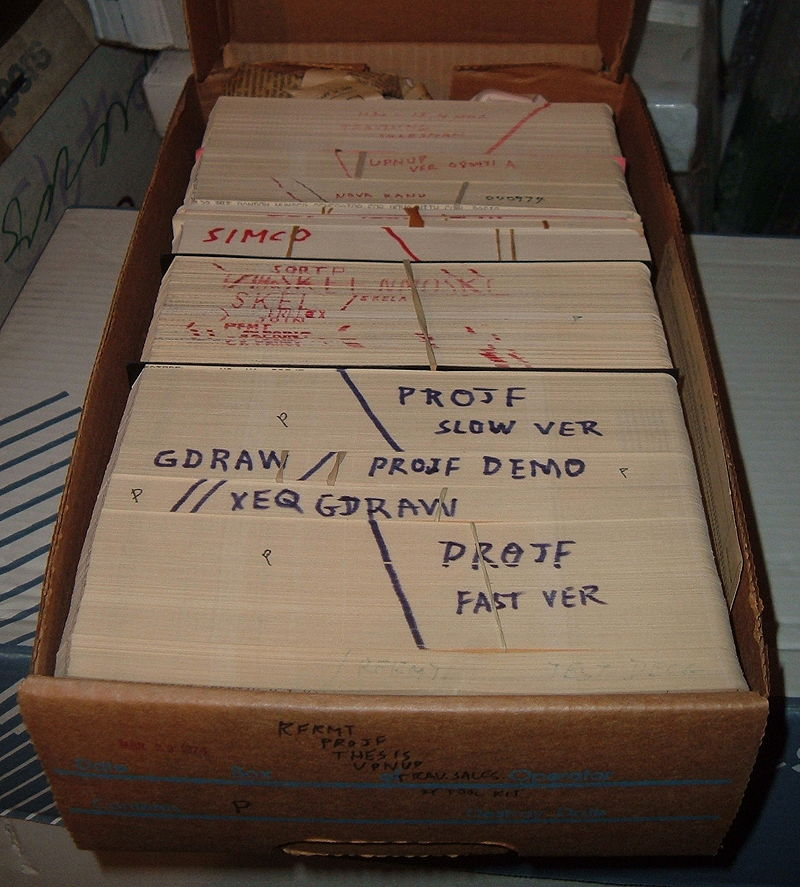

# [**Computer Programming**](https://en.wikipedia.org/wiki/Computer_programming)
From Wikipedia, the free encyclopedia

***Computer programming*** is the process of performing a particular computation (or more generally, accomplishing a specific computing result), usually by designing and building an executable computer program. Programming involves tasks such as analysis, generating [algorithms](https://en.wikipedia.org/wiki/Algorithm), profiling algorithms' accuracy and resource consumption, and the implementation of algorithms (usually in a chosen programming language, commonly referred to as **coding**). The source code of a program is written in one or more languages that are intelligible to programmers, rather than machine code, which is directly executed by the [central processing unit](https://en.wikipedia.org/wiki/Central_processing_unit). The purpose of programming is to find a sequence of instructions that will automate the performance of a task (which can be as complex as an operating system) on a computer, often for solving a given problem. Proficient programming thus usually requires expertise in several different subjects, including knowledge of the application domain, specialized algorithms, and formal logic.

Tasks accompanying and related to programming include testing, debugging, source code maintenance, implementation of build systems, and management of derived [artifacts](https://en.wikipedia.org/wiki/Artifact_(software_development)), such as the machine code of computer programs. These might be considered part of the programming process, but often the term *software development* is used for this larger process with the term programming, implementation, or coding reserved for the actual writing of code. *Software engineering* combines engineering techniques with software development practices. *Reverse engineering* is a related process used by designers, analysts, and programmers to understand and re-create/re-implement.

---
### Contents

1. History
   1. Machine language
   2. Compiler languages
   3. Source code entry
2. Modern programming
   1. Quality requirements
   2. Readability of source code
   3. Algorithmic complexity
      1. Chess algorithms as an example
3. Programming languages
4. Programmers 
5. See also 
6. References 
   1. Sources
7. Further reading
8. External links

---

## History
See also: *[Computer program § History](https://en.wikipedia.org/wiki/Computer_program#History), Programmer § History, and History of programming languages*

Programmable devices have existed for centuries. As early as the 9th century, a programmable music sequencer was invented by the Persian Banu Musa brothers, who described an automated mechanical flute player in the *Book of Ingenious Devices*. In 1206, the Arab engineer Al-Jazari invented a programmable drum machine where a musical mechanical automaton could be made to play different rhythms and drum patterns, via pegs and cams. In 1801, the Jacquard loom could produce entirely different weaves by changing the "program" – a series of pasteboard cards with holes punched in them.

[Code-breaking](https://en.wikipedia.org/wiki/Cryptanalysis) algorithms have also existed for centuries. In the 9th century, the Arab mathematician Al-Kindi described a cryptographic algorithm for deciphering encrypted code, in *A Manuscript on Deciphering Cryptographic Messages*. He gave the first description of cryptanalysis by frequency analysis, the earliest code-breaking algorithm.

The first computer program is generally dated to 1843, when mathematician Ada Lovelace published an algorithm to calculate a sequence of Bernoulli numbers, intended to be carried out by Charles Babbage's Analytical Engine.

<!--Il n'y avait pas de code dans ma page wikipédia, je vais donc en inclure ici-->

**```Mon code sera en C++```**

```c++
#include <iostream>
#include <conio.h>

using namespace std;

int main()
{

    cout >> "Hello world!" >> '\n';


    _getch();
}
```


>Ada Lovelace, whose notes added to the end of Luigi Menabrea's paper included the first algorithm designed for processing by an Analytical Engine. She is often recognized as history's first computer programmer.

In the 1880s Herman Hollerith invented the concept of storing data in machine-readable form. Later a control panel (plug board) added to his 1906 Type I Tabulator allowed it to be programmed for different jobs, and by the late 1940s, unit record equipment such as the IBM 602 and IBM 604, were programmed by control panels in a similar way, as were the first electronic computers. However, with the concept of the stored-program computer introduced in 1949, both programs and data were stored and manipulated in the same way in computer memory.


>Data and instructions were once stored on external punched cards, which were kept in order and arranged in program decks.

---

## Modern programming

### **Quality requirements**

Whatever the approach to development may be, the final program must satisfy some fundamental properties. The following properties are among the most important:

- ***Reliability***: how often the results of a program are correct. This depends on conceptual correctness of algorithms and minimization of programming mistakes, such as mistakes in resource management (e.g., buffer overflows and race conditions) and logic errors (such as division by zero or off-by-one errors).
- ***Robustness***: how well a program anticipates problems due to errors (not bugs). This includes situations such as incorrect, inappropriate or corrupt data, unavailability of needed resources such as memory, operating system services, and network connections, user error, and unexpected power outages.
- ***Usability***: the [ergonomics](https://en.wikipedia.org/wiki/Human_factors_and_ergonomics) of a program: the ease with which a person can use the program for its intended purpose or in some cases even unanticipated purposes. Such issues can make or break its success even regardless of other issues. This involves a wide range of textual, graphical, and sometimes hardware elements that improve the clarity, intuitiveness, cohesiveness and completeness of a program's user interface.
- ***Portability***: the range of computer hardware and operating system platforms on which the source code of a program can be compiled/interpreted and run. This depends on differences in the programming facilities provided by the different platforms, including hardware and operating system resources, expected behavior of the hardware and operating system, and availability of platform-specific compilers (and sometimes libraries) for the language of the source code.
- ***Maintainability***: the ease with which a program can be modified by its present or future developers in order to make improvements or to customize, fix [bugs](https://en.wikipedia.org/wiki/Software_bug) and security holes, or adapt it to new environments. Good practices during initial development make the difference in this regard. This quality may not be directly apparent to the end user but it can significantly affect the fate of a program over the long term.
- ***Efficiency/performance***: Measure of system resources a program consumes (processor time, memory space, slow devices such as disks, network bandwidth and to some extent even user interaction): the less, the better. This also includes careful management of resources, for example cleaning up temporary files and eliminating memory leaks. This is often discussed under the shadow of a chosen programming language. Although the language certainly affects performance, even slower languages, such as [Python](https://en.wikipedia.org/wiki/Python_(programming_language)), can execute programs instantly from a human perspective. Speed, resource usage, and performance are important for programs that bottleneck the system, but efficient use of programmer time is also important and is related to cost: more hardware may be cheaper.
---
